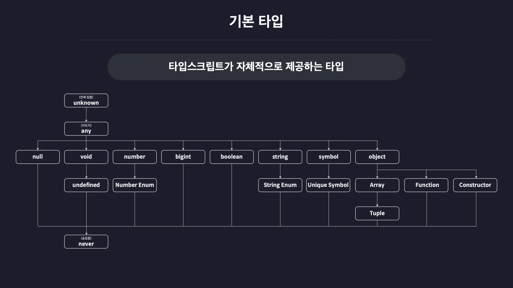

# typescript 동작 원리

## typescript 컴파일 과정

1. Typescript 코드 -> AST(추상 문법 트리)
2. 타입 검사 --> 검사 실패시 컴파일 종료
3. Javascript 코드 생성
4. Javascript 코드 -> AST(추상 문법 트리)
5. AST -> 바이트 코드
6. 실행

## typescript 설치

### types/node 설치
- node.js에서 기본적으로 제공하는 코드들의 타입정보를 가진 패키지 설치
- `npm install @types/node`
    ```json
    "dependencies": {
        "@types/node": "^22.13.14"
    }
    ```

### typescript 컴파일러
- `npm install -g typescript`
    - 글로벌로 설치

### typescript 컴파일러 실행
- `tsc {**.ts}`
    - index.ts : typescript로 직접 작성한 코드
        ```typescript
        console.log("Hello Typescript!");
        const a: number = 1;
        ```
    - `tsc index.ts`
    - index.js : index.ts 파일이 변환된 파일
        ```javascript
        console.log("Hello Typescript!");
        var a = 1;
        ```

### ts-node 모듈 (node 20버전 이상에서는 동작 X)
- typescript 컴파일러와 node.js가 함께 있음
- 설치: `npm install -g ts-node`
- 실행: `ts-node {**.ts}`

### TSX(TypeScript Execute)
- 역시 typescript 컴파일러와 node.js가 함께 있음
    ```shell
    $ tsx -v
    tsx v4.19.3
    node v22.14.0
    ```
- 설치: `npm install -g tsx`
- 실행: `tsx {**.ts}`

## typescript 컴파일러 옵션

- 타입 오류 검사 정도나 js 버전을 어떻게 할지 등을 선택할 수 있음
- 컴파일러 파일 기본 생성: `tsc --init` --> `tsconfig.json` 생성
- [tsconfig.json](./section_1/tsconfig.json)
- tsconfig.json을 사용하여 typescript 재인덱스: `ctrl + shift + p` -> restart -> `restart TS server`

# typescript 기본 타입



## type의 기본

### type annotation (타입 주석)
- `:` 과 함께 선언되는 타입을 `type annotation`이라고 함
    ```typescript
    let num1: number = 123;
    ```

### type 별칭
- `type` 키워드 사용
- js 컴파일 시 다 사라짐

### enum
- javascript로 컴파일 시 사라지지 않고 객체로 남아있음
- 때문에 값처럼 넣어서 사용 가능

## 타입은 집합이다.

- 타입스크립트가 말하는 타입은 집합이다.
